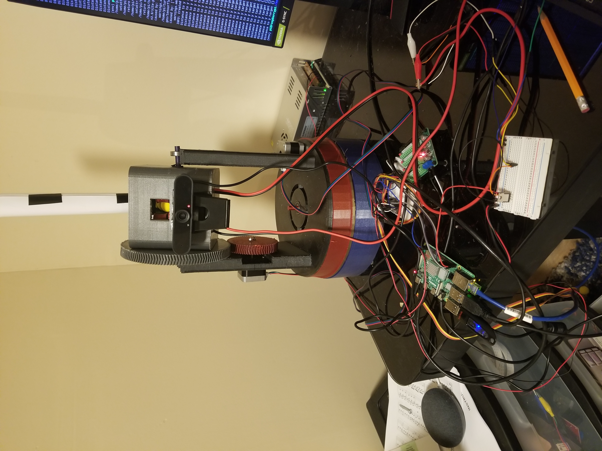
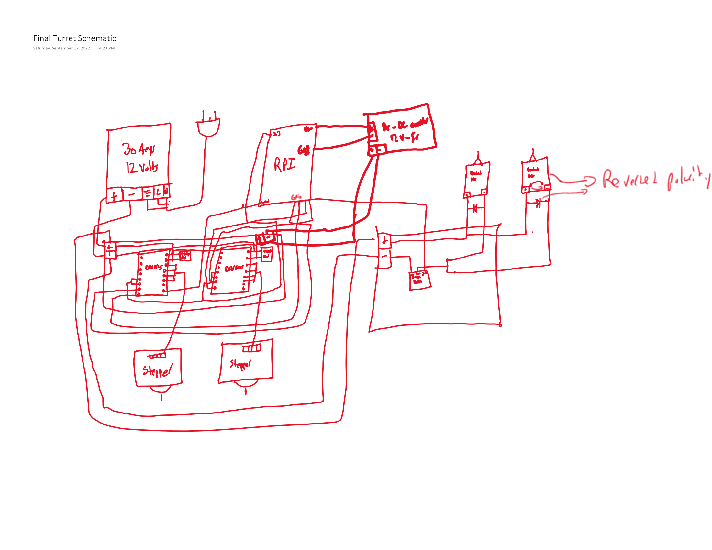

# Nerf-Turret

# What is this

This is a 2-axis turret that shoots nerf rival ammo

# Details

The turret uses a RPi 4B, a camera, and the tflite movenet lightning convolutional neural network to enable it to autonomously track and fire at the average position across all viewable human joints. Simply stated, there is no hiding from this thing. If any joints can be seen, they will be shot at.

# Demo

# Schematic

